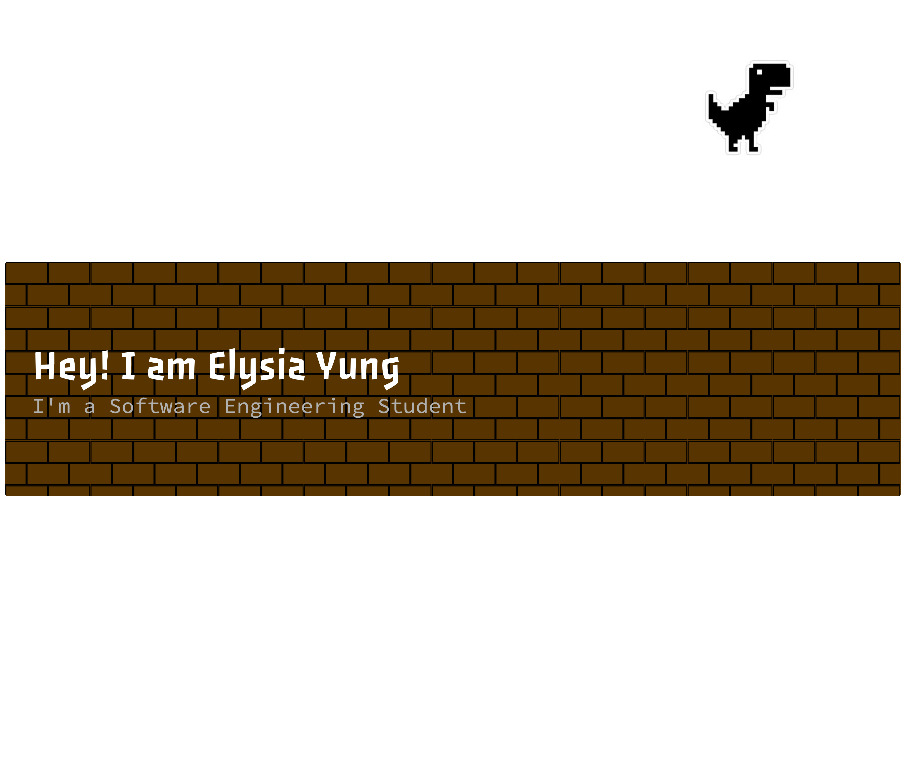

## Hi, I'm Elysia! 👋

I'm a Software Engineering student who enjoys exploring how technology can turn ideas into useful applications. I'm interested in creating software that is both functional and easy to use, and I'm always looking for opportunities to learn and improve my skills.

Outside of my studies, I enjoy exploring cafés and watching movies. ☕🎬

## My Expectations for WIF3005 📚

Through the Software Maintenance and Evolution course, I hope to learn how to improve existing software and keep it useful as requirements change.

In particular, I look forward to:

- **Understanding legacy systems** and the challenges of maintaining existing code.
- **Learning to fix bugs and refactor code** while preserving existing functionality.
- **Gaining hands-on experience with GitHub**, pull requests, and code reviews.
- **Developing better teamwork skills** and writing clearer documentation.

By the end of this course, I hope to feel more confident working with existing software and contributing meaningful improvements.

